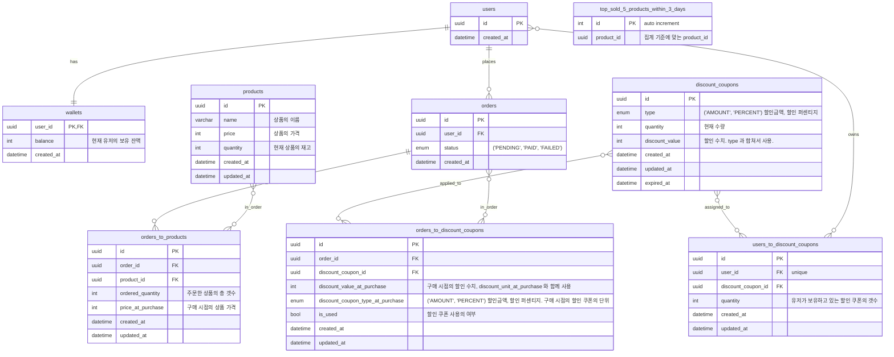

```mermaid
erDiagram
%%  ----- ----- users ----- -----
    users ||--|| wallets: has
    users ||--o{ orders: places
    users }o--o{ users_to_discount_coupons: owns
    users {
        uuid id PK
        datetime created_at
    }
%%  ----- ----- users ----- -----

%%  ----- ----- wallets ----- -----
    wallets {
        uuid user_id PK, FK
        int balance "현재 유저의 보유 잔액"
        datetime created_at
    }
%%  ----- ----- wallets ----- -----

%%  ----- ----- products ----- -----
    products }o--o{ orders_to_products: in_order
    products {
        uuid id PK
        varchar name "상품의 이름"
        int price "상품의 가격"
        int quantity "현재 상품의 재고"
        datetime created_at
        datetime updated_at
    }
%%  ----- ----- products ----- -----

%%  ----- ----- orders ----- -----
    orders }o--o{ orders_to_discount_coupons: in_order
    orders ||--o{ orders_to_products: in_order
    orders {
        uuid id PK
        uuid user_id FK
        enum status "('PENDING', 'PAID', 'FAILED')"
        datetime created_at
    }
%%  ----- ----- orders ----- -----

%%  ----- ----- discount_coupons ----- -----
    discount_coupons }o--o{ users_to_discount_coupons: assigned_to
    discount_coupons }o--o{ orders_to_discount_coupons: applied_to
    discount_coupons {
        uuid id PK
        enum type "('AMOUNT', 'PERCENT') 할인금액, 할인 퍼센티지"
        int quantity "현재 수량"
        int discount_value "할인 수치. type 과 합쳐서 사용."
        datetime created_at
        datetime updated_at
        datetime expired_at
    }
%%  ----- ----- discount_coupons ----- -----

%%  ----- ----- top-sold 5 products within 3 days  ----- -----
    top_sold_5_products_within_3_days {
        int id PK "auto increment"
        uuid product_id "집계 기준에 맞는 product_id"
    %%Event + Procedure 로 30분에 1번 통계 처리를 수행
    }
%%  ----- ----- top-sold 5 products within 3 days  ----- -----

%%  ----- ----- orders <-> products ----- -----
    orders_to_products {
        uuid id PK
        uuid order_id FK
        uuid product_id FK
        int ordered_quantity "주문한 상품의 총 갯수"
        int price_at_purchase "구매 시점의 상품 가격"
        datetime created_at
        datetime updated_at
    }

%%  ----- ----- orders <-> discount_coupons ----- -----
    orders_to_discount_coupons {
        uuid id PK
        uuid order_id FK
        uuid discount_coupon_id FK
        int discount_value_at_purchase "구매 시점의 할인 수치, discount_unit_at_purchase 와 함께 사용"
        enum discount_coupon_type_at_purchase "('AMOUNT', 'PERCENT') 할인금액, 할인 퍼센티지. 구매 시점의 할인 쿠폰의 단위"
        bool is_used "할인 쿠폰 사용의 여부"
        datetime created_at
        datetime updated_at
    }
%%  ----- ----- orders <-> discount_coupons ----- -----

%%  ----- ----- users <-> discount_coupons ----- -----
    users_to_discount_coupons {
        uuid id PK
        uuid user_id FK "unique"
        uuid discount_coupon_id FK
        int quantity "유저가 보유하고 있는 할인 쿠폰의 갯수"
        datetime created_at
        datetime updated_at
    }
%%  ----- ----- users <-> discount_coupons ----- -----
```