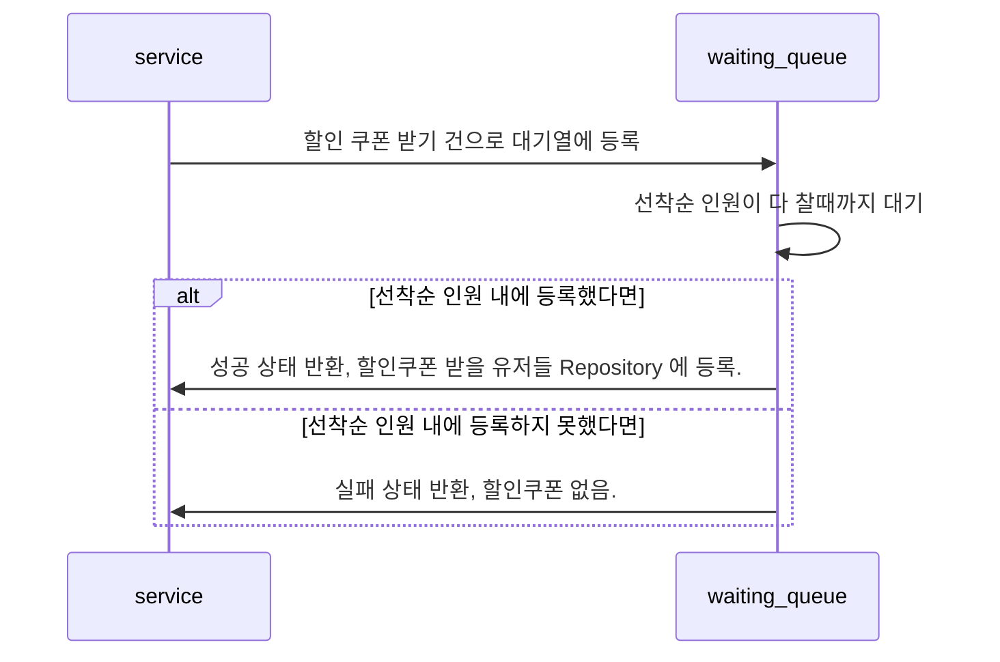

```mermaid
sequenceDiagram
    participant service
    participant waiting_queue
    service ->> waiting_queue: 할인 쿠폰 받기 건으로 대기열에 등록
    waiting_queue ->> waiting_queue: 선착순 인원이 다 찰때까지 대기
    alt 선착순 인원 내에 등록했다면
        waiting_queue ->> service: 성공 상태 반환, 할인쿠폰 받을 유저들 Repository 에 등록.
    else 선착순 인원 내에 등록하지 못했다면
        waiting_queue ->> service: 실패 상태 반환, 할인쿠폰 없음.
    end

```
