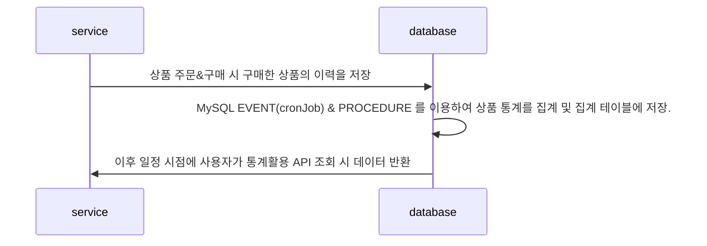

```mermaid
sequenceDiagram
    participant service
    participant database
    service ->> database: 상품 주문&구매 시 구매한 상품의 이력을 저장
    database ->> database: MySQL EVENT(cronJob) & PROCEDURE 를 이용하여 상품 통계를 집계 및 집계 테이블에 저장.
    database ->> service: 이후 일정 시점에 사용자가 통계활용 API 조회 시 데이터 반환
```